# Mini-Momentum

Summarise, ask questions from a transcript.

## Table of Contents

- [Thought Process](#thought-process)
- [System Diagram](#system-diagram)
- [Tech Stack](#tech-stack)
- [Environment Variables](#environment-variables)
- [Installation](#installation)
- [AI usage](#ai-usage)
- 
---

## Thought Process
## Approach

### 1. Initial Planning
Broke down the assignment into 3 core functional modules:
  1. Transcript Generation Module – generates transcripts using OpenAI client.
  2. Summarization Module – Summarises the transcript using the OpenAI client.
  3. Question Answer Module – answers user questions contextually using transcript and prior Q&A history..
  4. OpenAI Integration:
      - Initially used manual WebClient calls.
      - Switched to `spring-ai-openai-spring-boot-starter` for abstraction and YAML-based configuration.

**Prompt Engineering:**
- Used OpenAI documentation and Playground to prompt design and optimization.
- The PromptConstants contain the System and user prompts for each module.
- Caveat: OpenAI's Chat Completion API is stateless ,therefore each request goes with System and user prompt.
---
### 2. Transcript Generation
- Used OpenAI Chat Completion API for generating transcript content,
- Since the Completion API is stateless, unique ID generation was handled internally using database primary keys.
- The language of the generated transcript is set to English by default, but can be customized via the `language` parameter in the request.

**Response Handling:**
- The OpenAI response contains excess metadata.
- Only the "content" key was extracted and used as the final transcript string.

---

### 3. Summarization Logic
- Reviewed Momentum.io summary styles and focused on:
  - Action items
  - Pipeline risk
  - Churn indicators
  - Call insights
- Designed the summary schema to capture these details with fields like `insights`, `objections`, and `churnRisks` , etc (useful in sync feature).

**Output Format:**
- Used JSON to ensure compatibility with tools like Salesforce that use SObjects, or any other sync service.
- The summary is structured as a `SummaryDTO` with fields for:
  - `transcriptId`
  - `language`
  - `summaryText`
  - `summaryDetails` (nested DTO for structured data)

**Storage Strategy:**
- Used a composite key `(transcriptId + language)` to enforce idempotency:
  - Existing summary → update
  - New summary → insert
- Persistence:
  - Full summary text in `summaryText`
  - Structured data in a nested `SummaryDetailsDTO`
---

### 4. Question Answering
- Used OpenAI Chat Completion API to generate answers for questions asked in the context to transcripts.
- The prompt for QA included, UserPrompt + Context (Transcript + Previous Q&A history) to keep the Completion API in context.
- The response to end user is given as: Answer: {Returned response from OpenAI}
- Internally all the QA are joined by its transcript ID and stored in the database.
- The question and answer language can be dynamically set via asking in that language or adding "respond in {lang} language" to the question.

- **Persistence:**
- All services have operated with entity via hibernate(JPA).
- For the persistence-file-based database, H2 embedded was the winning choice. 
- The database is at  `/data` directory within the application for file-level access.
- The Relationship between Transcript to Summary and Question answer was `One-to-Many`.
- The summary is linked to the `Transcript` entity via a foreign key.
- The `QuestionAnswer` entity is linked to the `Transcript` entity via a foreign key.

---

## System Diagram



---
## Tech Stack
**Backend:**
- SpringBoot 

**Database:**
- SQL (H2: embedded)

**Testing:**
- Junit 5
- Mockito

**AI assistance:**
--Chatgpt for suggestion

---

## Installation
**Prerequisites:**
- Java 17 JDK
- Maven 3.8+
- OpenAI API key

## Environment Variables

### Required
```
| Variable         | Description                              |
|------------------|------------------------------------------|
| `OPENAI_API_KEY` | OpenAI key for Client service |
```
### Optional
```
| Variable       | Description                    
|----------------|--------------------------------
| `H2_USERNAME`  | Username for H2 embedded database access 
| `H2_PASSWORD`  | Password for H2 embedded database access 
````

**Installation**
- `git clone https://github.com/shubhamrly/minimomentum.git`

- `mvn spring-boot:run -Dspring.ai.openai.api-key=<OPENAI_API_KEY>`
       
    OR
- put it in the application configuration in intelliJ as 
 ```
Key: spring.ai.openai.api-key
    
Value : OPENAI_API_KEY
```
-- then `mvn spring-boot:run` OR run button


-- use `mvn test` for testing

***AI usage***
- The test cases skeleton is produced via gpt assistant, but the actual code by done by me. 
- The application used suggestion by IDE.
- Some comments are autogenerated by AI, but the actual code is written by me.
- The AI-generated content has been marked with /** AI-Generated** /

***Resources used***
- OPEN AI playground: Chat Prompt service to refine prompts. 
- <a href="https://platform.openai.com/docs/api-reference/chat/create">OpenAI API Reference</a>
- <a href ="https://docs.spring.io/spring-ai/reference/getting-started.html"> Spring AI Documentation</a>
- <a href="https://spring.io/guides/gs/testing-web">Spring Testing Guide</a>


